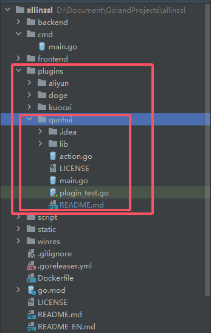
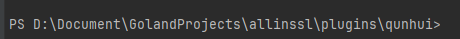

# AllinSSL_plugins_qunhui
AllinSSL插件，将AllinSSL的证书部署到群晖
# 食用方法
1.下载release中的文件
2.自行编译
# 自行编译方法
- 请确保已安装Go 1.23+环境：[前往下载地址](https://golang.google.cn/dl/)
- [进入AllinSSL仓库](https://github.com/allinssl/allinssl)
- 克隆仓库并下载依赖
```bash
git clone https://github.com/allinssl/allinssl.git
cd allinssl
```
- 继续执行,设置go镜像  
windows
```bash
$env:GO111MODULE = "on"
$env:GOPROXY = "https://goproxy.cn"
```
mac or linux
```bash
export GO111MODULE=on
export GOPROXY=https://goproxy.cn
```
- 继续执行,下载依赖
```bash
go mod tidy
```
- 将本项目放入plugins目录

- 进入qunhui文件夹

- 下一步进入编译，前者是你开发的平台，后者是你运行的平台
- windows 编译 windows
```bash
go build
```
- windows 编译 linux，你是arm平台就把amd64改为arm64
```bash
$env:GOOS = "linux"
$env:GOARCH = "amd64"
go build
```
- windows 编译 mac，你是arm平台就把amd64改为arm64
```bash
$env:GOOS = "darwin"
$env:GOARCH = "amd64"
go build
```
- linux 编译 linux
```bash
go build
```
- linux 编译 windows
```bash
export GOOS = "windows"
export GOARCH = "amd64"
go build
```
- linux 编译 mac
```bash
export GOOS = "darwin"
export GOARCH = "amd64"
go build
```
- 将编译好的文件保存下来，进行下一步选择操作
- docker：映射/www/allinssl/plugins到本地，然后把编译好的程序直接放进去
- 源码编译：编译好的程序直接放入allinssl程序同级plugins文件夹，没有自己创建